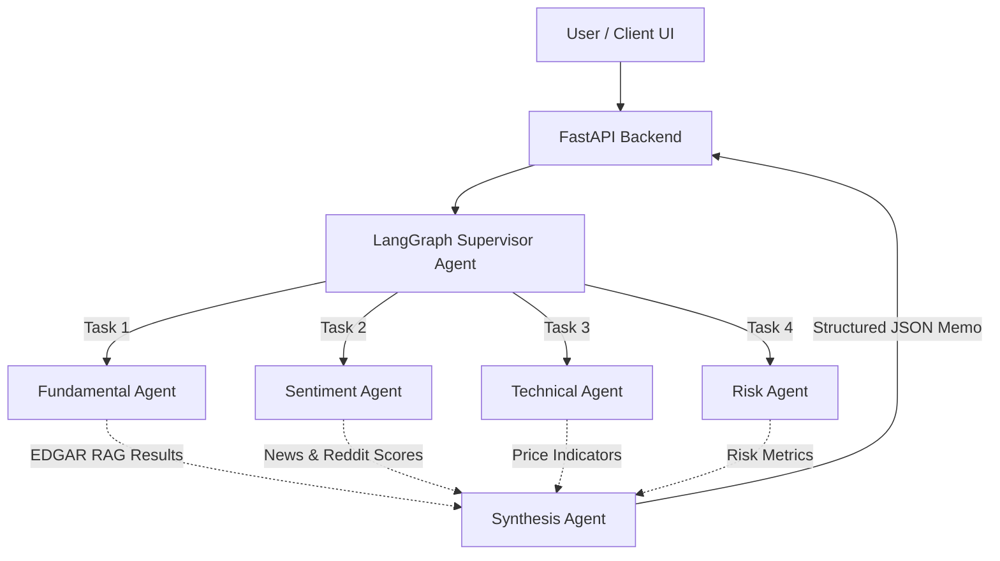

# Quant Research AI 📈

> **The first AI quant research platform for retail investors.**

A multi-agent system built to orchestrate complex quantitative research. Instead of relying on a single LLM to act as a "financial analyst," this architecture uses the **Supervisor-Agent Pattern** to coordinate specialized sub-agents in parallel—dramatically reducing processing time while keeping each agent's context clean and focused.

## 🏗 System Architecture

The architecture is built around LangGraph, defining a DAG of agent nodes run in parallel by a Supervisor.

## 🛠 Tech Stack

*   **Agent Layer**: LangGraph (DAG orchestration), Claude API (Sonnet 3.5/4.5), `sentence-transformers` (local embeddings).
*   **Backend**: Python, FastAPI (REST + SSE streaming), Celery + Redis (async agent jobs).
*   **Backtesting Engine**: Java 21 (performance-critical loop over historical OHLCV data).
*   **Storage**: PostgreSQL + `pgvector` (vectors + structured), Redis (API response cache).
*   **Frontend**: Next.js 15 (dashboard), Recharts (price + signal charts), TailwindCSS (styling).

## 📊 Data Sources (100% Free Tier)

*   **SEC EDGAR**: Every US public company's 10-K, 10-Q, 8-K, earnings transcripts.
*   **Yahoo Finance (`yfinance`)**: OHLCV price data, financial statements.
*   **NewsAPI**: Cached news scraping across 80,000 sources.
*   **NSE India (`nsetools`)**: Live and historical data for all Nifty/BSE stocks.
*   **Alpha Vantage**: Fundamentals data (EPS, revenue, balance sheet).
*   **Reddit (PRAW)**: Retail sentiment from `r/investing`, `r/wallstreetbets`.

